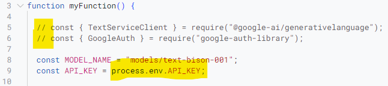
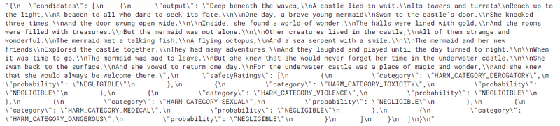

# GenerativeLanguageApp

## Experimenting with Prompt Engineering in MakerSuite

Google has a number of LLMs that are generally available to developers, including foundation models trained for text, chat and code which are accessible as part of the [PaLM 2 API](https://ai.google/discover/palm2/). To help developers explore the capabilities of these models, Google has created the MakerSuite site:

> MakerSuite is a fast, easy way to start building generative AI apps. It provides an efficient UI for prompting some of Google’s latest models and easily translates prompts into production-ready code you can integrate into your applications. 

MakerSuite has just gone generally available for a number of countries and to coincide with this announcement the Google Developers Blog has started a series on ‘[Make with MakerSuite](https://developers.googleblog.com/2023/09/make-with-makersuite-part1-introduction.html)’. 

## Using MakerSuite with Google Apps Script

One of the nice features of the MakerSuite prompt design process is to click a button to generate a code snippet you can use in your own dev environment. To make the iterative process this repo contains `GenerativeLanguageApp`, a Google Apps Script helper class which you can use to make it easier to test prompts designed in MakerSuite.

The class is based on the [PaLM 2 API](https://ai.google/discover/palm2/) and uses a modified version of the Google Node.js client library. Once you’ve created/saved an API key, you can drop these code snippets into your Google Apps Script project and get prompt responses:

## Setting up GenerativeLanguageApp

1. Create a new Google Apps Script project ([script.new](https://script.new))

2. Add a new script file named **GenerativeLanguage** and copy/paste [GenerativeLanguage.js](GenerativeLanguage.js)

3. Add a new script file named **ENV** and copy/paste the [ENV.js](ENV.js)

4. In the **Project Settings** scroll to **Script Properties** and **Add a script property** named **API_KEY** with an [API key value generated in MakerSuite](https://makersuite.google.com/app/apikey) and click **Save script properties**

## Using **GenerativeLanguageApp** with MakerSuite

1. In MakerSuite create a new prompt (or use one of the sample prompts)

2. Click ‘**< > Get code**’ and click on the **JavaScript tab** and copy the code

3. In your Google Apps Script project open **Code.gs** and paste the code into **`myFunction()`**

4. Remove or comment out the lines which have the require calls 

5. Replace `"YOUR API KEY"` with `process.env.API_KEY`

6. Save the script and **Run > myFunction**

If everything has worked you should have a response recorded in the Execution log similar to the one below:

Example execution log

You can continue to experiment with prompt text and setting in the code in the Apps Script editor.
